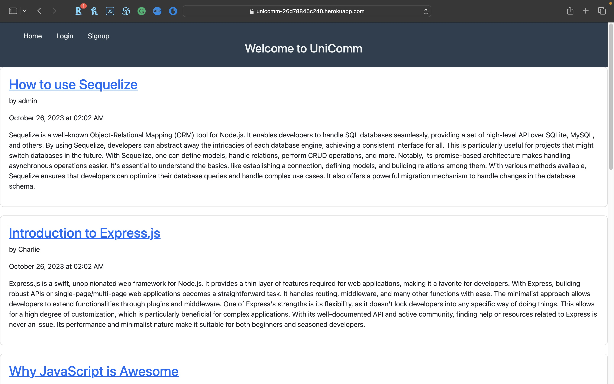
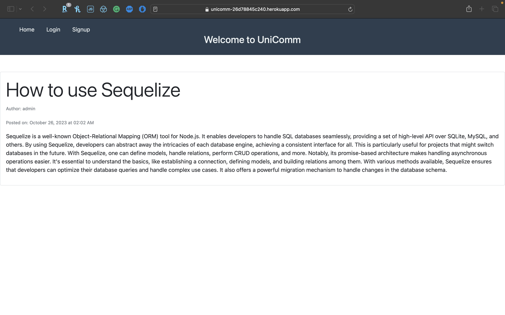

# UniComm

## Description

In the world of tech, writing plays a pivotal role alongside coding. Whether it's the dissemination of new concepts, sharing of recent technological advancements, or tutorials on intricate topics, written content aids in the education and enlightenment of the global developer community. A cursory online search reveals a plethora of articles, blog posts, and think pieces written by developers across various expertise levels, emphasizing the significance of written communication in this domain.

The "UniComm" project aims to provide a platform for tech enthusiasts, especially developers, to share their insights, tutorials, and thoughts on technology. The platform is inspired by the functionality of popular blogging systems like WordPress but is tailored to cater specifically to the tech community.

Core Features:

1. User-Centric Design: Upon visiting the platform, users will be greeted with a homepage showcasing existing blog posts, navigational links, and authentication options.
2. Dynamic Interactivity: Depending on their authentication status, users can sign up, log in, or interact with available blog posts. Once logged in, they have the freedom to create, update, or delete their articles. They can also comment on posts made by other developers.
3. Seamless User Experience: The navigation is designed to be intuitive, guiding users seamlessly from the homepage to their personal dashboard, and offering clear prompts for signing up or logging in where necessary.
4. High-Level Security: With security being paramount, passwords are hashed using the bcrypt package. Sessions are maintained using the express-session npm package, ensuring users are periodically prompted to log in after periods of inactivity.
5. MVC Paradigm: The platform's architecture is based on the Model-View-Controller (MVC) paradigm. It employs Handlebars.js for templating (View), Sequelize ORM for database interactions (Model), and Express.js for routing and controllers (Controller).

## Table of Contents
- [Usage](#usage)
- [License](#license)
- [Contributions](#contributions)
- [Questions](#questions)
- [Screenshots](#screenshots)
- [Link to the Deployed Application](#link-to-the-deployed-application)

## Usage

For the UniComm platform, initiate by opening your browser and directing it to the application's URL. The welcoming homepage will present a selection of existing blog posts alongside various navigation aids. If you're new to UniComm, register with a distinctive username and password; if you're returning, simply log in with your established credentials. Inside, your dashboard becomes a hub for content creation, modification, and deletion. Dive into community discussions by exploring posts by fellow developers, and don't forget to drop your insights through comments. To safeguard your data, ensure you log out after each session. Whenever inspiration strikes or you crave some tech insights, UniComm awaits your return.

## License

This project is licensed under the MIT License. For more details, please see the LICENSE file.

## Contributions

N/A

## Questions

For any questions, please contact me at [https://github.com/kojootchere](https://github.com/kojootchere) or [email me](mailto:kojootchere@gmail.com).

## Screenshots

## Link to the Deployed Application

Link to Deployed Application: https://unicomm-26d78845c240.herokuapp.com